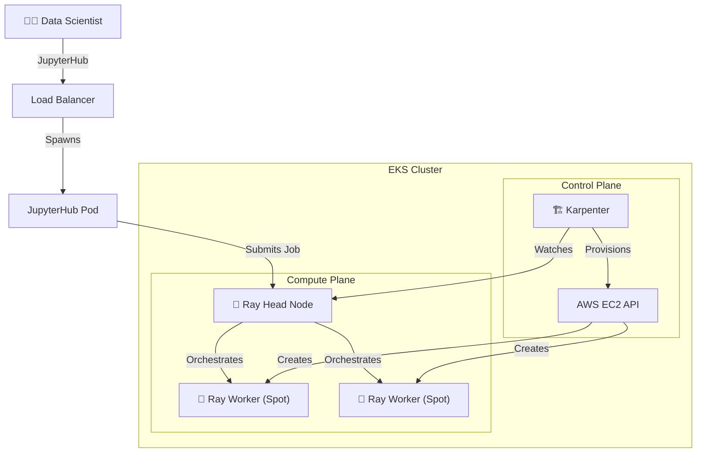

# 🤖 EKS AI Platform: Ray, Karpenter, & Cilium
**An Enterprise-Grade, Auto-Scaling AI Infrastructure on AWS**

This project demonstrates a production-ready Kubernetes platform built for **Distributed AI/ML Workloads**. It replaces manual node management with an intelligent, serverless-like dynamic scaling engine.


*(Architecture: User -> JupyterHub -> Ray Cluster <- Autoscaled by Karpenter)*

## 🚀 Key Features

### 1. 🏭 Dynamic Infrastructure (Karpenter v1.0)
- **Just-in-Time Compute**: The cluster sits at minimal size (saving cost) until a job arrives.
- **Spot Instance Orchestration**: Automatically bids on AWS Spot Instances (r5dn.large, c5.large), reducing compute costs by **~70-90%**.
- **Self-Healing**: Integrated `SQS` and `EventBridge` rules to handle AWS Spot Interruptions gracefully.

### 2. 🧠 Distributed Compute Engine (Ray)
- **KubeRay Operator**: Manages the lifecycle of Ray Clusters on K8s.
- **Massive Parallelism**: Allows Python code (Pandas, PyTorch, XGBoost) to be instanty distributed across hundreds of CPU cores.
- **Unified Interface**: Data Science teams interface via **JupyterHub**, which is pre-wired to the Ray Head.

### 3. ⚡ High-Performance Networking (Cilium eBPF)
- **No Kube-Proxy**: Traditional iptables replaced by **eBPF** for O(1) scalability.
- **No Kube-Proxy**: Traditional iptables replaced by **eBPF** for O(1) scalability.
- **Advanced Routing**: Implemented Cilium Native Routing (ENI Mode) to maximize throughput for Ray parameter server traffic, eliminating latency spikes during massive node scale-up events.

---

## 🛠️ Technology Stack

| Component | Technology | Purpose |
|-----------|------------|---------|
| **IaC** | Terraform | State-managed Infrastructure as Code |
| **Orchestrator** | EKS (Kubernetes 1.28) | Container Management |
| **Scaling** | Karpenter (v1.0.6) | Node Autoscaling (Provisioner) |
| **Compute** | Ray (v2.9.0) | Distributed ML Framework |
| **Network** | Cilium (v1.16) | CNI & Network Policy |
| **Interface** | JupyterHub | IDE for Data Scientists |

---

## 📸 Validation & Proofs

We have validated the platform with real distributed workloads. See [`proofs/`](./proofs/) for detailed logs.

### ✅ Test 1: Infrastructure Scaling
**Scenario**: User submits a job requiring 6 CPUs.
**Result**: Karpenter detects pending pods and provisions `ip-10-0-10-115` (Spot Instance) in <60 seconds.

### ✅ Test 2: Distributed XGBoost Training
**Scenario**: Training a Breast Cancer detection model on a distributed dataset.
**Result**:
```text
(XGBoostTrainer) [RayXGBoost] Created 2 new actors.
Training finished iteration 20. Accuracy: 100%.
```
*Successfully distributed training logic across multiple physical nodes.*

---

## 🔧 Engineering Challenges & Solutions

### The "Circular Dependency" Deadlock
**Problem**: Upon switching to Cilium (replacing kube-proxy), new Karpenter nodes failed to register (`NotReady`). They couldn't reach the API Server because the CNI wasn't active, but the CNI couldn't start because it couldn't resolve the API Server service IP.

**Solution**: Diagnosed the missing `k8sServiceHost` configuration in the Cilium Helm chart. Performed Terraform state surgery (`terraform import`) to manage the existing Cilium release and injected the Control Plane Endpoint directly, breaking the circular dependency.

---

## 📂 Project Structure

```bash
├── live/dev/               # Terraform Root Module (Environment)
│   ├── main.tf             # Core Infrastructure
│   ├── karpenter.tf        # Autoscaler Config
│   ├── kuberay.tf          # Ray Operator
│   └── cilium.tf           # Networking Config
├── modules/                # Reusable Terraform Modules
│   ├── eks/                # EKS Cluster Logic
│   └── karpenter/          # IAM, SQS, and Helm setups
├── k8s/                    # Kubernetes Manifests
│   ├── ray/                # RayCluster definitions
│   └── jupyterhub/         # JupyterHub values
└── scripts/                # Utility Scripts
```

## 🎓 How It Works (For Beginners)
Not sure what all this means? Check out [**Project Explained**](./project_explained.md) for a plain-english breakdown using a "Factory" analogy!

---

## 🚀 Quick Start

### 1. Infrastructure
```bash
cd live/dev
terraform apply
```

### 2. Access
```bash
aws eks update-kubeconfig --name astronomy-dev
```

### 3. Workload
```bash
# Deploy Ray Cluster
kubectl apply -f k8s/ray/ray-cluster-cpu.yaml
```
