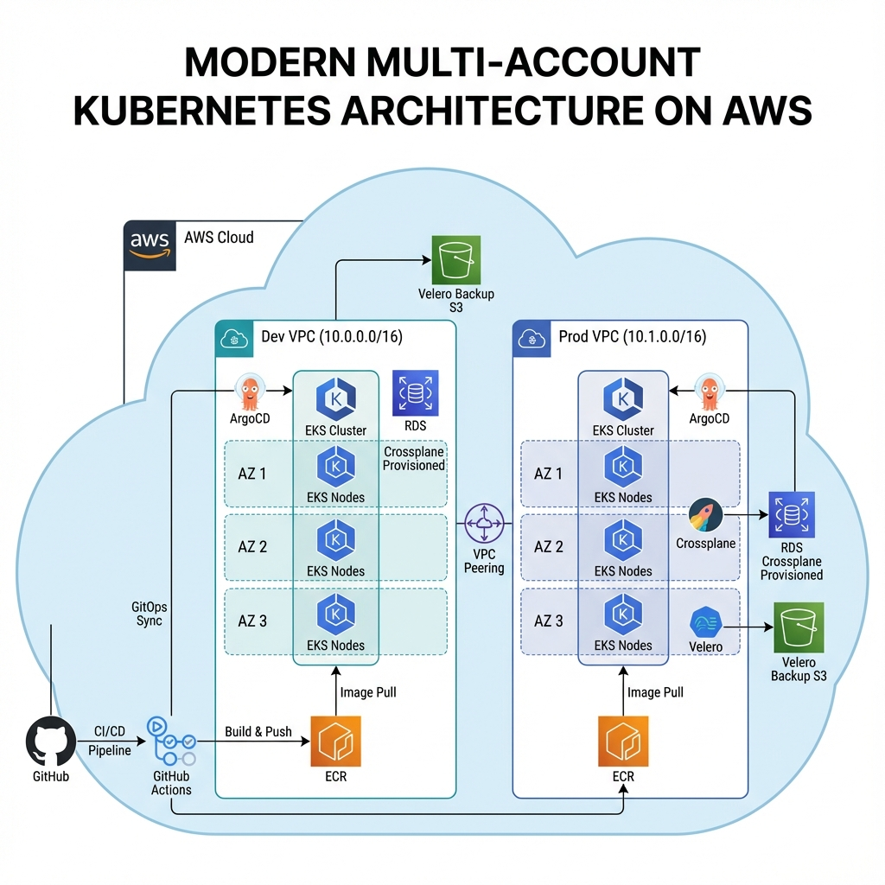
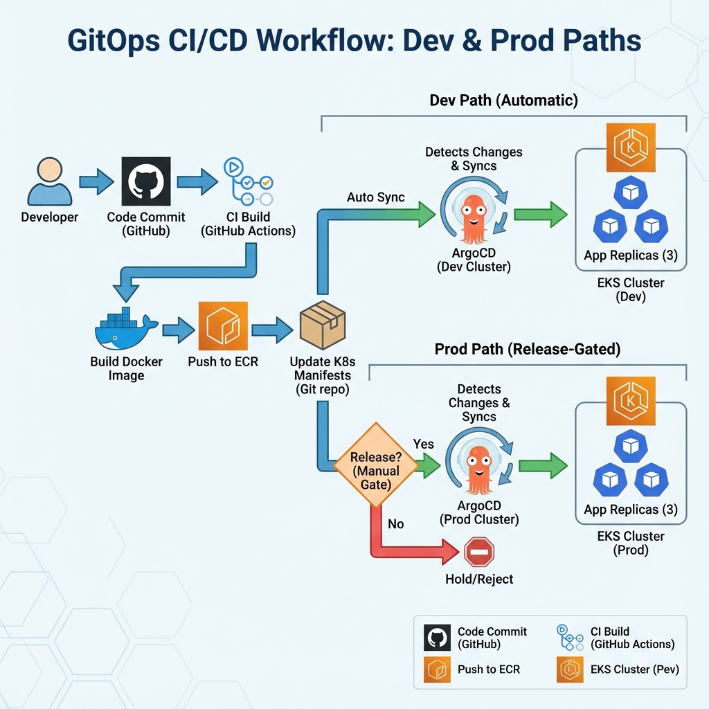
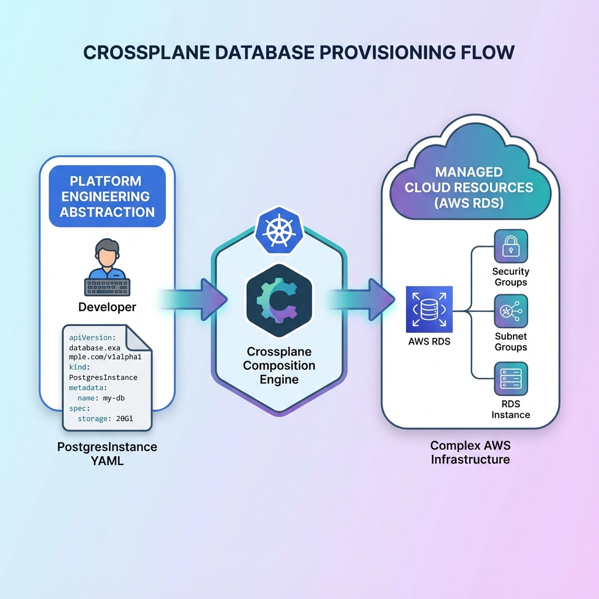

# 🚀 Astronomy Platform - Enterprise Kubernetes Platform

[](https://www.terraform.io/)
[](https://kubernetes.io/)
[](https://aws.amazon.com/eks/)
[](https://argoproj.github.io/cd/)
[](https://www.crossplane.io/)

> **A production-ready Internal Developer Platform (IDP) built with Terraform, EKS, ArgoCD, Crossplane, and Velero**

This project demonstrates enterprise-grade platform engineering practices, implementing a complete multi-environment Kubernetes platform with self-service database provisioning, GitOps deployment, and disaster recovery capabilities.

---

## 📋 Table of Contents

- [Overview](#-overview)
- [Architecture](#-architecture)
- [Key Features](#-key-features)
- [Technology Stack](#-technology-stack)
- [Project Structure](#-project-structure)
- [Getting Started](#-getting-started)
- [Environments](#-environments)
- [GitOps Workflow](#-gitops-workflow)
- [Database Provisioning](#-database-provisioning)
- [Disaster Recovery](#-disaster-recovery)
- [CI/CD Pipeline](#-cicd-pipeline)
- [Lessons Learned](#-lessons-learned)

---

## 🎯 Overview

The Astronomy Platform is a **self-service Kubernetes platform** that enables developers to:

- 🚀 Deploy applications with a single `git push`
- 💾 Provision databases via Kubernetes manifests (no AWS Console needed)
- 🔄 Automatically sync infrastructure and application state
- 🛡️ Recover from disasters with one-click backup restoration
- 🌍 Manage multiple environments (Dev/Prod) with environment-specific configurations

**Built for:** Platform Engineers, DevOps Engineers, Cloud Architects

**Demonstrates:** Infrastructure as Code, GitOps, Platform Engineering, Cloud-Native Architecture

---

## 🏗️ Architecture



### **High-Level Components**

| Component | Purpose | Technology |
|-----------|---------|------------|
| **Infrastructure** | Cloud resources provisioning | Terraform + AWS |
| **Orchestration** | Container management | Amazon EKS (Kubernetes 1.28) |
| **GitOps** | Declarative deployment | ArgoCD |
| **Database** | Self-service RDS provisioning | Crossplane v2 |
| **Backup** | Disaster recovery | Velero + S3 |
| **CI/CD** | Automated pipelines | GitHub Actions |

### **Network Architecture**

- **Dev VPC:** `10.0.0.0/16` (Cost-optimized, Spot instances)
- **Prod VPC:** `10.1.0.0/16` (High-availability, On-Demand instances, Multi-AZ)
- **Isolation:** Complete network separation between environments
- **Connectivity:** NAT Gateways for private subnet internet access

---

## ✨ Key Features

### 🎯 **1. Multi-Environment Management**
- Separate Terraform workspaces for Dev and Prod
- Environment-specific configurations via Kustomize overlays
- Isolated VPCs and EKS clusters

### 🔄 **2. GitOps Deployment**


- **Dev:** Auto-deploys on every commit to `main`
- **Prod:** Gated deployments via GitHub Releases
- ArgoCD continuously syncs cluster state with Git

### 💾 **3. Self-Service Database Provisioning**


Developers request databases with simple YAML:

```yaml
apiVersion: database.platform.io/v1alpha1
kind: PostgresInstance
metadata:
  name: my-database
spec:
  parameters:
    size: large      # Abstracted sizing
    storage: 20      # GB
    version: "14"
```

Crossplane automatically provisions:
- ✅ AWS RDS instance
- ✅ Security groups
- ✅ Subnet groups
- ✅ Connection secrets

### 🛡️ **4. Disaster Recovery**
- **Automated Backups:** Velero snapshots to S3 every 24 hours
- **Tested Recovery:** Successfully restored deleted deployments
- **Defense in Depth:** ArgoCD (instant drift correction) + Velero (catastrophic recovery)

### 🚀 **5. CI/CD Pipeline**
- **Build:** Docker images on every commit
- **Push:** Automated ECR uploads
- **Deploy:** GitOps write-back triggers ArgoCD sync
- **Release:** Production deployments via semantic versioning

---

## 🛠️ Technology Stack

### **Infrastructure**
- **Terraform** - Infrastructure as Code
- **AWS EKS** - Managed Kubernetes
- **VPC** - Network isolation
- **ECR** - Container registry

### **Platform Tools**
- **ArgoCD** - GitOps continuous deployment
- **Crossplane v2** - Kubernetes-native infrastructure provisioning
- **Velero** - Backup and disaster recovery
- **Kustomize** - Environment-specific configurations

### **Application**
- **Go** - Booking service microservice
- **PostgreSQL** - Relational database (RDS)
- **Docker** - Containerization

### **CI/CD**
- **GitHub Actions** - Automated pipelines
- **GitHub Releases** - Production gating

---

## 📁 Project Structure

```
terraform-platform/
├── .github/workflows/       # CI/CD pipelines
│   ├── deploy-dev.yaml     # Dev auto-deployment
│   └── deploy-prod.yaml    # Prod release-gated
│
├── app-source/             # Application code
│   └── booking-service/    # Go microservice
│
├── argocd/                 # GitOps applications
│   ├── booking-service-dev.yaml
│   └── booking-service-prod.yaml
│
├── crossplane/             # Database provisioning
│   ├── postgres-xrd.yaml           # Custom API
│   ├── postgres-composition.yaml   # Dev mapping
│   ├── postgres-composition-prod.yaml
│   └── postgres-*.yaml             # Database claims
│
├── k8s/                    # Kubernetes manifests
│   ├── base/              # Shared resources
│   └── overlays/
│       ├── dev/           # Dev overrides
│       └── prod/          # Prod overrides (3 replicas, resources)
│
├── live/                   # Terraform environments
│   ├── dev/
│   └── prod/
│
└── modules/                # Reusable Terraform modules
    ├── vpc/
    ├── eks/
    ├── crossplane/
    └── velero/
```

---

## 🚀 Getting Started

### **Prerequisites**
- AWS Account with admin access
- Terraform >= 1.5
- kubectl >= 1.28
- Helm >= 3.0
- Docker
- Git

### **1. Clone Repository**
```bash
git clone https://github.com/sikander098/astronomy-platform.git
cd astronomy-platform
```

### **2. Configure AWS Credentials**
```bash
aws configure
```

### **3. Deploy Dev Environment**
```bash
cd live/dev
terraform init
terraform apply -auto-approve
```

### **4. Connect to Cluster**
```bash
aws eks update-kubeconfig --region us-east-1 --name astronomy-dev
```

### **5. Install Platform Tools**
```bash
# ArgoCD
kubectl create namespace argocd
kubectl apply -n argocd -f https://raw.githubusercontent.com/argoproj/argo-cd/stable/manifests/install.yaml

# Crossplane (installed via Terraform module)
# Velero (installed via Terraform module)
```

### **6. Deploy Application**
```bash
kubectl apply -f argocd/booking-service-dev.yaml
```

---

## 🌍 Environments

### **Development**
- **Purpose:** Rapid iteration and testing
- **VPC:** `10.0.0.0/16`
- **Cluster:** `astronomy-dev`
- **Nodes:** Spot instances (cost-optimized)
- **Deployment:** Auto-sync on commit
- **Database:** `db.t3.micro` (10GB)

### **Production**
- **Purpose:** Stable, high-availability workloads
- **VPC:** `10.1.0.0/16`
- **Cluster:** `astronomy-prod`
- **Nodes:** On-Demand, Multi-AZ
- **Deployment:** Release-gated
- **Database:** `db.t3.medium` (20GB)
- **Replicas:** 3 (High Availability)

---

## 🔄 GitOps Workflow

### **Development Flow**
1. Developer commits code to `main`
2. GitHub Actions builds Docker image
3. Image pushed to ECR with commit SHA tag
4. Pipeline updates `k8s/overlays/dev/kustomization.yaml`
5. ArgoCD detects change and syncs to cluster
6. Application updated automatically

### **Production Flow**
1. Create GitHub Release (e.g., `v1.0.0`)
2. GitHub Actions extracts release tag
3. Updates `k8s/overlays/prod/kustomization.yaml` with version
4. ArgoCD syncs to production cluster
5. 3 replicas deployed across availability zones

**Key Benefit:** Git is the single source of truth. No manual `kubectl apply` needed.

---

## 💾 Database Provisioning

### **Traditional Approach (Manual)**
```bash
# 1. Log into AWS Console
# 2. Navigate to RDS
# 3. Click "Create Database"
# 4. Fill 20+ configuration fields
# 5. Wait 15 minutes
# 6. Manually create security groups
# 7. Copy credentials to Kubernetes secrets
```

### **Platform Approach (Self-Service)**
```yaml
# 1. Create YAML file
apiVersion: database.platform.io/v1alpha1
kind: PostgresInstance
metadata:
  name: booking-db-dev
spec:
  parameters:
    size: small
    storage: 10
    version: "14"
```

```bash
# 2. Apply to cluster
kubectl apply -f postgres-dev.yaml

# 3. Done! Crossplane handles everything:
# ✅ RDS instance
# ✅ Security groups
# ✅ Subnet groups
# ✅ Connection secrets
```

**Developer Experience:** From 30 minutes to 30 seconds.

---

## 🛡️ Disaster Recovery

### **Backup Strategy**
- **Frequency:** Daily automated backups
- **Retention:** 30 days
- **Scope:** Entire cluster state (deployments, configs, secrets)
- **Storage:** S3 with versioning

### **Recovery Process**
```bash
# 1. List backups
velero backup get

# 2. Restore from backup
velero restore create --from-backup daily-backup-20231201

# 3. Verify restoration
kubectl get pods
```

### **Tested Scenarios**
- ✅ Accidental deployment deletion
- ✅ Namespace corruption
- ✅ Configuration drift

**Recovery Time:** < 5 minutes

---

## 🚀 CI/CD Pipeline

### **Pipeline Stages**

#### **1. Build**
```yaml
- Checkout code
- Build Docker image
- Tag with commit SHA
```

#### **2. Push**
```yaml
- Login to ECR
- Push image
- Tag as 'latest' (dev) or version (prod)
```

#### **3. Deploy**
```yaml
- Update Kustomize manifest
- Commit change to Git
- Push to repository
```

#### **4. Sync**
```yaml
- ArgoCD detects change
- Pulls new manifest
- Applies to cluster
```

### **Pipeline Metrics**
- **Build Time:** ~2 minutes
- **Deploy Time:** ~30 seconds
- **Total Time:** < 3 minutes (commit to running)

---

## 📚 Lessons Learned

### **1. Crossplane v2 Migration**
- **Challenge:** Crossplane v2 removed `resources` field in Compositions
- **Solution:** Migrated to Composition Functions (`function-patch-and-transform`)
- **Learning:** Always check breaking changes in major version upgrades

### **2. IAM Role Naming**
- **Challenge:** Global IAM role names caused conflicts between environments
- **Solution:** Parameterized role names with environment suffix
- **Learning:** Design for multi-environment from day one

### **3. GitOps Write-Back**
- **Challenge:** Pipeline needed to commit manifest changes
- **Solution:** GitHub Actions with PAT for write access
- **Learning:** GitOps requires bidirectional Git integration

### **4. Velero vs ArgoCD**
- **Challenge:** Unclear which tool handles recovery
- **Solution:** Tested both independently
- **Learning:** ArgoCD = drift correction, Velero = disaster recovery (complementary)

### **5. Production Readiness**
- **Challenge:** Dev configs not suitable for production
- **Solution:** Kustomize overlays with environment-specific patches
- **Learning:** Separate concerns early (base vs overlays)

---

## 🎓 Skills Demonstrated

- ✅ **Infrastructure as Code** (Terraform)
- ✅ **Kubernetes Administration** (EKS, kubectl, Helm)
- ✅ **GitOps** (ArgoCD, declarative deployments)
- ✅ **Platform Engineering** (Crossplane, self-service)
- ✅ **CI/CD** (GitHub Actions, automated pipelines)
- ✅ **Disaster Recovery** (Velero, backup/restore)
- ✅ **Cloud Architecture** (AWS VPC, Multi-AZ, HA)
- ✅ **Containerization** (Docker, ECR)
- ✅ **Go Development** (Microservices)
- ✅ **DevOps Best Practices** (Immutable infrastructure, GitOps)

---

## 📊 Project Stats

- **Lines of Terraform:** ~1,200
- **Kubernetes Manifests:** 25+
- **Environments:** 2 (Dev, Prod)
- **Modules:** 4 (VPC, EKS, Crossplane, Velero)
- **CI/CD Pipelines:** 2
- **Automated Commits:** 3 (GitOps write-back)
- **Backup Tests:** 3 successful restorations

---

## 🔗 Related Resources

- [Terraform AWS EKS Module](https://registry.terraform.io/modules/terraform-aws-modules/eks/aws)
- [ArgoCD Documentation](https://argo-cd.readthedocs.io/)
- [Crossplane Documentation](https://docs.crossplane.io/)
- [Velero Documentation](https://velero.io/docs/)
- [Kustomize Documentation](https://kustomize.io/)

---

## 📝 License

This project is licensed under the MIT License - see the [LICENSE](LICENSE) file for details.

---

## 👤 Author

**Sikander**

- GitHub: [@sikander098](https://github.com/sikander098)
- Project: [astronomy-platform](https://github.com/sikander098/astronomy-platform)

---

## 🙏 Acknowledgments

- Inspired by platform engineering best practices
- Built with open-source tools from the CNCF ecosystem
- Special thanks to the Crossplane, ArgoCD, and Velero communities

---

**⭐ If you found this project helpful, please consider giving it a star!**
